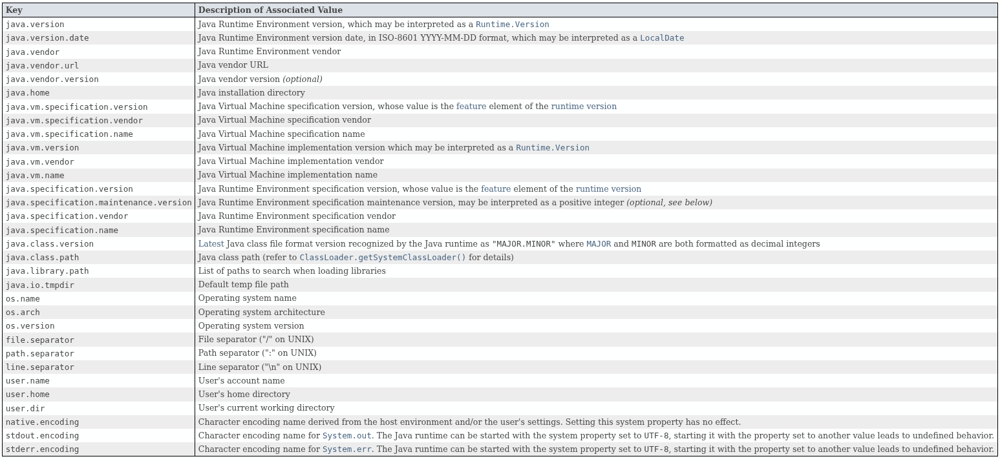
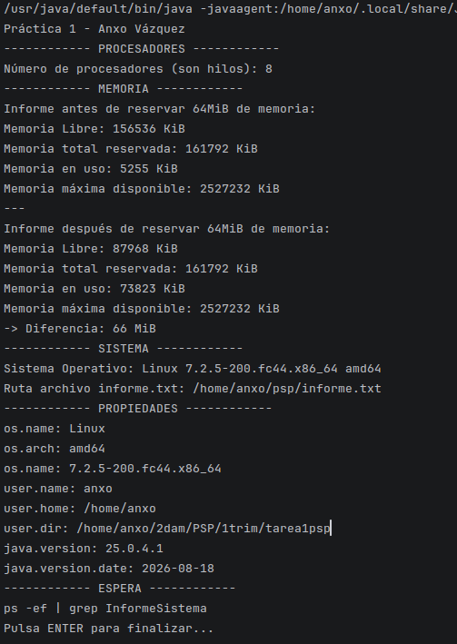

# Tarea 1 - Radiografía del sistema

### Alumno

- Anxo Vázquez Lorenzo

### Asignatura

- PSP - Programación de servizos e procesos

## Programa

> En esta sección explicaré decisiones y funcionamientos de ciertas partes del código que he encontrado más relevantes

### `mostrarMemoria()`

En este método utilizo la clase y método `Runtime.getRuntime` para mirar las propiedades de la memoria y dividirlas entre 1024 para que la muestre en `KiB`, para calcular la memoria en uso resto la memoria libre a la memoria total.

```
public static void mostrarMemoria(){
        System.out.println("Memoria Libre: " + (Runtime.getRuntime().freeMemory() / 1024) + " KiB");
        System.out.println("Memoria total reservada: " + (Runtime.getRuntime().totalMemory() / 1024) + " KiB");
        System.out.println("Memoria en uso: " + ((Runtime.getRuntime().totalMemory() - Runtime.getRuntime().freeMemory()) / 1024) + " KiB");
        System.out.println("Memoria máxima disponible: " + (Runtime.getRuntime().maxMemory() / 1024) + " KiB");
    }
```

### `getBytesMemoriaUso()`

Adicionalmente este método lo uso para que me devuelva únicamente la memoria en uso y así poder calcular la diferencia de 64 `MiB`.

```
public static long getBytesMemoriaUso(){
        return Runtime.getRuntime().totalMemory() - Runtime.getRuntime().freeMemory();
    }
```

### `mostrarPropiedades()`

Este método usa `System.getProperty` y se puede usar de dos formas:

- Sin argumentos -> Muestra todas las propiedades

- Con algún argumento -> Muestra sólo ese argumento

Los argumentos disponibles son:



>Fuente captura-> Documentación oficial de java https://docs.oracle.com/javase/8/docs/api/java/lang/System.html#getProperties--

### `main()`

Este es el iniciador del programa que utilizará todos los métodos anteriormente creados para mostrar el reporte del sistema.

**Aclaraciones**

Para reservar los `64 MiB` de memoria creo un array de variables `long` con la capacidad suficiente para llenar esos `64 MiB`:

```
long[] reservado = new long[8 * 1024 * 1024]; //64 MiB
```

Para pausar al final del reporte y que el programa no finalice su ejecución utilizo `Scanner`:

```
System.out.println("ps -ef | grep InformeSistema\nPulsa ENTER para finalizar...");
Scanner sc = new Scanner(System.in);
sc.useDelimiter("\n"); //Por defecto es un espacio
sc.nextLine();
sc.close();
```

## El proceso desde fuera

### Ejecución desde el `IDE`

Ejecuto el programa y cuando entra en espera por la lectura del `scanner`, ejecuto en otra terminal el siguiente comando:

```
ps -ef | grep InformeSistema
```

Al ejecutar el comando anterior se muestran dos entradas, la primera es de `InformeSistema` y la segunda es del `grep` que se usó para filtrar la búsqueda dentro de la salida del ps.

El segundo (`PID`) y tercer (`PPID`) campo indican los identificadores del propio proceso y el del padre.


Si realizo la misma búsqueda pero indicando el `PPID` se muestra el proceso padre, que en este caso es el propio `ide` ya que se lanzó desde ahí:


### Ejecución desde la terminal


Compruebo su `pid` y `ppid` y veo que cambian los dos, ahora el padre es `bash` (intérprete de comandos) y el `pid` cambió porque el sistema operativo le asignó otro.


### Ejecución con `Xmx128m`

`Xmx128m` establece la memoria límite que la `JVM` puede usar, al ejecutarlo con ese límite se puede ver que cambia la sección de memoria.

**Limitado:**


**Sin limitación:**


### Ruta archivo `informe.txt`

```
//Sección del código InformeSistema, en la función mostrarMultiplataforma()
System.out.println("Ruta archivo informe.txt: " + System.getProperty("user.home") + System.getProperty("file.separator") + "psp" + System.getProperty("file.separator") + "informe.txt");
```

Esta ruta se vería modificada por el divisor (`file.separator`) y por la ruta del `home`(`user.home`).

Por ejemplo, si fuese en `windows` la salida sería parecida a esta:

```
C:\Usuarios\anxo\psp\informe.txt
```

## Tipo de Programación

- a-Un servidor web que atiende 500 peticiones a la vez en una máquina de 8 núcleos.

Programación paralela, ya que aunque la máquina tenga muchos núcleos son muchas peticiones simultáneas y al usar programación concurrente se desperdiciaría los 8 núcleos del procesador. El único inconveniente sería que, al ser una única máquina,si esa máquina "cae", se cae todo el sistema ya que no es distribuida.

- b-Renderizar una película de animación en un plazo de tres meses.

Programación concurrente, aunque la tarea sea pesada el plazo es muy grande y, de mientras, los otros procesadores se podrían usar sin problema para otro tipo de tareas.

- c-Una app de móvil que descarga un fichero mientras seguís navegando.

Programación paralela, se necesitan hacer varias cosas simultáneamente aunque sus tareas sean sencillas, el único inconveniente sería el "desperdicio" de tiempos en los procesadores para estas tareas.

- d-Un cálculo que no cabe en la RAM de un solo equipo.

Programación distribuida, al ser tan alta la demanda de un recurso (RAM, CPU, disco, etc) se necesitan varios equipos, el inconveniente principal sería el alto costo de estos.

## Salida completa



## Errores cometidos

### Compilación

Al lanzar el programa desde la terminal mostraba un error relacionado con la versión de java con la que se había compilado, me fijé que la versión de la terminal (`java --version`) y la del `IDE`(`Project Structure`) no coincidían, para ello cambié la versión de java en el `IDE` a la misma que tenía por terminal y volví a ejecutar para que cambiase el compilado `.class`.

### Errores de cálculo en la diferencia de memoria

Al calcular la diferencia de memoria al asignar `64 MiB` cometí errores de lógica al convertir mal las unidades de `bytes` a `MiB` dandome así resultados muy elevados.

## Bibliografía

Documentación oficial de java - Consulta de métodos para extraer propiedades:

- https://docs.oracle.com/javase/8/docs/api/java/lang/System.html#getProperty-java.lang.String-

- https://docs.oracle.com/en/java/javase/21/docs/api/java.base/java/lang/Runtime.html

- https://docs.oracle.com/en/java/javase/21/docs/api/java.base/java/util/Properties.html


