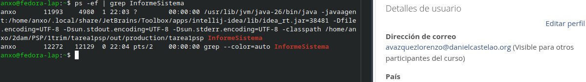
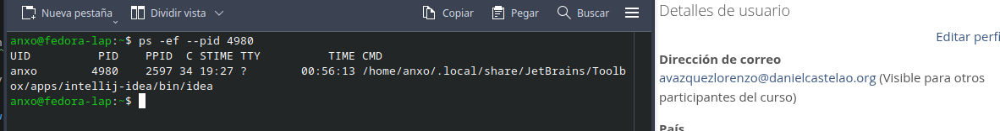
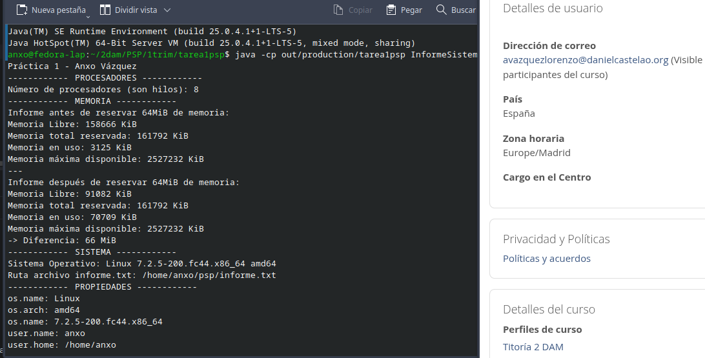
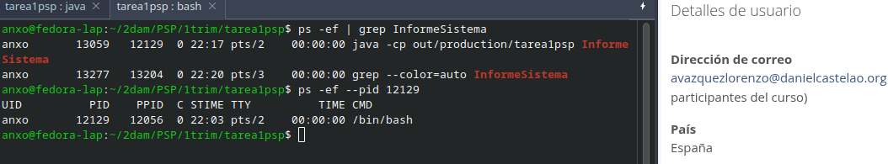
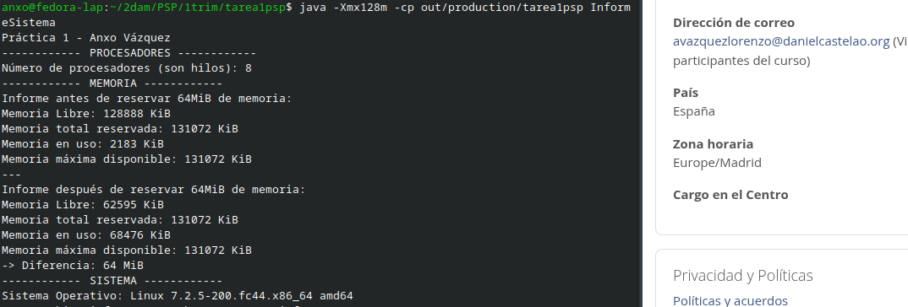
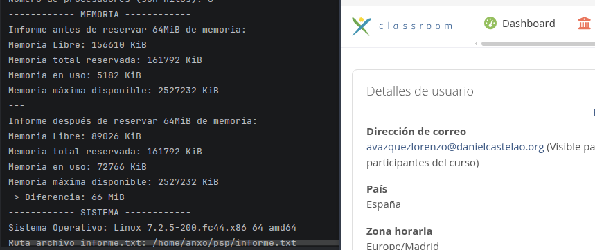

# Tarea 1 - Radiografía del sistema

### Alumno

- Anxo Vázquez Lorenzo

### Asignatura

- PSP - Programación de servizos e procesos

## El proceso desde fuera

### Ejecución desde el `IDE`

Ejecuto el programa y cuando entra en espera por la lectura del `scanner`, ejecuto en otra terminal el siguiente comando:

```
ps -ef | grep InformeSistema
```

Al ejecutar el comando anterior se muestran dos entradas, la primera es de `InformeSistema` y la segunda es del `grep` que se uso para filtrar la busqueda dentro de la salida del ps.

El segundo (`PID`) y tercer (`PPID`) campo indican los identificadores del propio proceso y el del padre.



Si realizo la misma búsqueda pero indicando el `PPID` se muestra el proceso padre, que en este caso es el propio `ide` ya que se lanzó desde ahí:



### Ejecución desde la terminal



Compruebo su `pid` y `ppid` y veo que cambian los dos, ahora el padre es `bash` (interprete de comandos) y el `pid` cambio porque el sistema operativo le asignó otro.



### Ejecución con `Xmx128m`

`Xmx128m` establece la memoria límite que la `JVM` puede usar, al ejecutarlo con ese limite se puede ver que cambia la sección de memoria.

**Limitado:**



**Sin limitación:**



### Ruta archivo `informe.txt`

```
//Sección del código InformeSistema, en la función mostrarMultiplataforma()
System.out.println("Ruta archivo informe.txt: " + System.getProperty("user.home") + System.getProperty("file.separator") + "psp" + System.getProperty("file.separator") + "informe.txt");
```

Esta ruta se vería modificada por el divisor (`file.separator`) y por la ruta del `home`(`user.home`).

Por ejemplo, si fuese en `windows` la salida sería parecida a esto:

```
C:\Usuarios\anxo\psp\informe.txt
```


